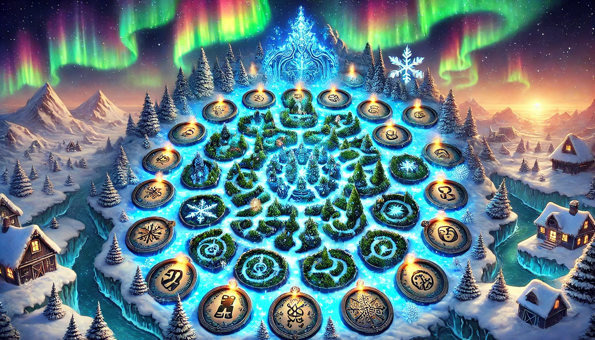

# aoc2024
Advent of code 2024

Totally ready for [Advent of Code](https://adventofcode.com) 2024! 
Last year, I've decided to document my journey on GitHub just for the kicks. 
This year, I'll continue. Just for the kicks. ğŸ„😠

### How to run
You need to provide your own puzzle inputs. Aoc doesn't allow sharing of one's own input. 
Create a DayX.txt file for each day at the root of the project.

- Run from command line: dotnet run
- Run from your favorite dotnet core IDE

## Day 1
 
Traditionally, this one was easy 🙂

## Day 2
 
Still easy-peasy. Don't forget the wrong value can be one earlier than you think 😉

## Day 3
 
Horrors of previous years flashed before my eyes, so I went to long type immediately! 
Wasted a lot of time, because the second input example was not the same as the first! 😅

## Day 4
 
TraverseDiagonalBackwards ...

## Day 5
 
IComparer Sort RuLeS!

## Day 6
 
Easy-peasy part 1. Part 2: I just knew we must detect loops!

## Day 7
 
Not too difficult, but some reason I got stuck on a <= test instead of a < 
For Part 2 I just knew we would have a || operator seeing example 156: 15 6

## Day 8
 
Easy-peasy day, nothing special, suspiciously ...

## Day 9
 
Flashbacks of Norton disk defragmenter 😆
Wasted too much time moving files too the right 🤦‍♂️
For part 2, totally moved files leave an empty space ...

## Day 10
 
Easy-peasy day? Yep, even part 2 😆

## Day 11
 
When I read exception message "The input string '-' was not in a correct format" I knew I needed to switch to long ... 
Part 2 was fun dynamic programming 😅

## Day 12
 
Easy-peasy day, again? Part 2 looked like parsing the regions.

## Day 13
 
Part 1 is a nice variation of math problem of Day 7 
The solution is just solving two equations! 🙈

## Day 14
 
Part 1 was easy, using a previous AoC method PositiveMod 
Part 2: form a christmas tree? What?

## Day 15
 
Problem description sounds familiar ... 
Sokoban vibes!

## Day 16
 
Day 10 comes in handy! Simple map traversing.

## Day 17
 
Part 1 was fun and easy. Part2, I really don't have a clue ...

## Day 18
 
Part 1 reused Day 10

## Day 19
 
Don't forget to also remember what does not match ...

## Day 20
 
Part 1 is easy. For part 2 I wasted so much time on wrong example cheat sums. 
I really needed to use the calculator instead of my head ... 😅

## Day 21
 
Oof 🫠

## Day 22
 
Part 1 is easy, as long as you use long.

## Day 23
 
Starts with t, not Contains t ...

Images generated by dall-e 2
