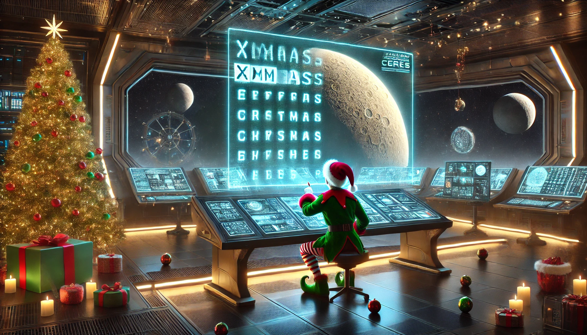

# aoc2024
Advent of code 2024

Totally ready for [Advent of Code](https://adventofcode.com) 2024! 
Last year, I've decided to document my journey on GitHub just for the kicks. 
This year, I'll continue. Just for the kicks. 🎄😎

## Day 1
 
Traditionally, this one was easy 🙂

## Day 2
 
Still easy-peasy. Don't forget the wrong value can be one earlier than you think 😉

## Day 3
 
Horrors of previous years flashed before my eyes, so I went to long type immediately!
Wasted a lot of time, because the second input example was not the same as the first! 😅

## Day 4
 
TraverseDiagonalBackwards ...

## Day 5
 
Sort RuLeS!

Images generated by dall-e 2
